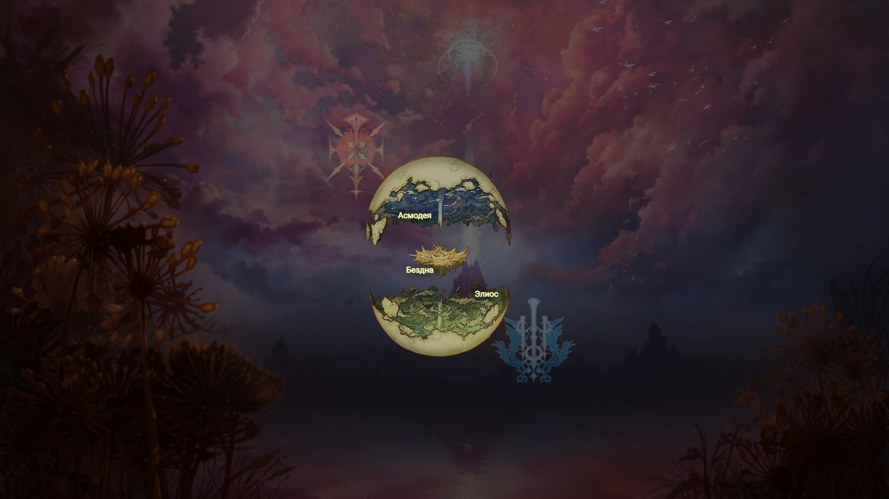
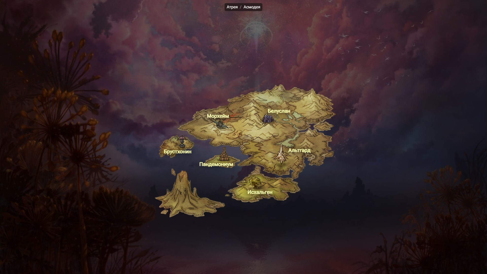
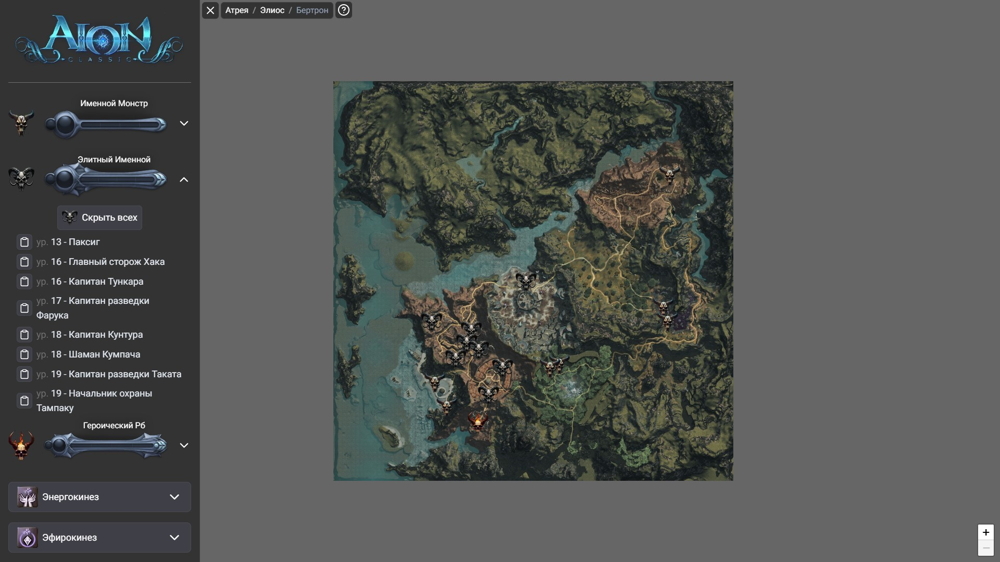
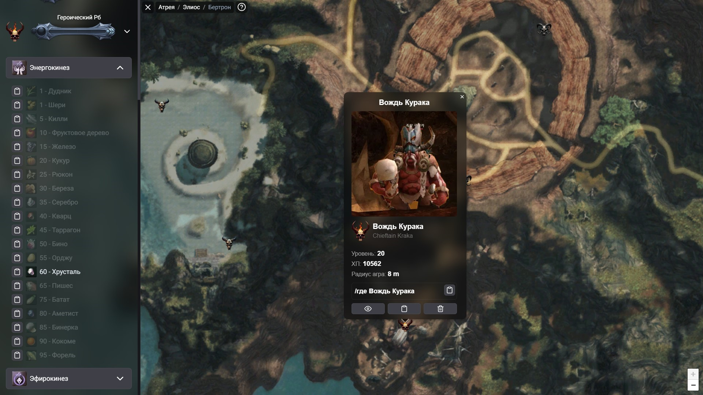
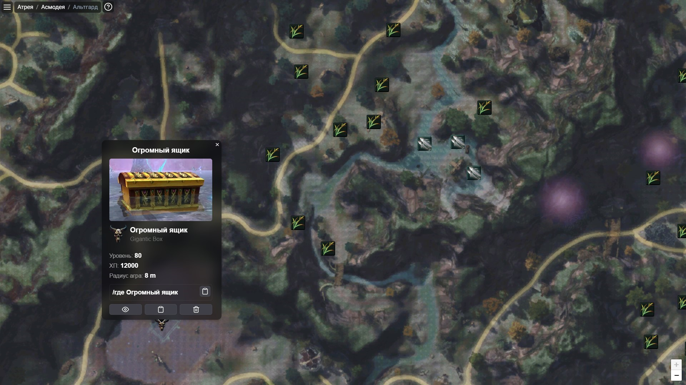
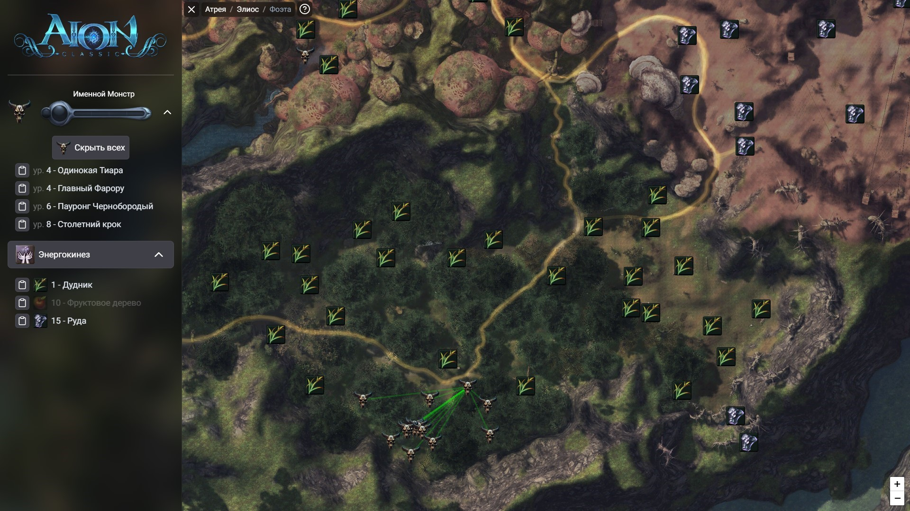

# Aion interactive map
Aion classic interactive map. Data related to Aion Classic 1.9.

## Features

- Show information about named monsters and raid bosses, essencetapping and aethertapping
- Hide/show on map selected markers with detail information
- Copy in-game coordinates
- Show all spawn places of the selected monsters

## Screenshots

Faction selection 

Location selection

Map of location

Detail information about the selected npc

All spawn places  for the selected npc

##  Built in
- Next.js 
- Leaflet.js 
- Tailwind

## Feedback

If you have any feedback, please reach out at vasilevich.dmt@gmail.com

